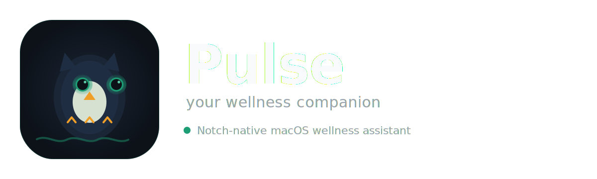

<p align="center">
  
</p>

<p align="center">
  <strong>Your macOS notch wellness companion</strong><br/>
  Gentle focus guidance, ambient visuals, and a tiny owl named Pip.
</p>

<p align="center">
  
  
  
  
</p>

---

## Overview

**Pulse** sits exactly where your eyes already are: the MacBook notch area.
Instead of disruptive reminders, it gives subtle, state-based wellness feedback about your current focus rhythm.

- **Pip-led UX**: a geometric owl avatar with expressive state animations
- **Notch-native UI**: idle, hover, and expanded layouts designed for ambient readability
- **Behavior-aware**: reacts to time-since-break, idle periods, and calendar meetings
- **Background agent**: runs as `LSUIElement = YES` with no Dock icon

---

## Key Features

### Notch states

- **Flow** (`< 90m`) - green pulse, calm expression
- **Heads-up** (`90-150m`) - amber pulse, light urgency
- **Rest now** (`150m+`) - red pulse, stronger break nudge

### Pip character system

- Emotion changes via eyes, eyelids, tufts, wings, and motion timing
- Tiny notch variant (`PipMiniView`) for 20x22 rendering
- Avatar variant (`PipAvatarView`) for notifications
- Warm, short, non-judgmental copy templates

### Wellness engine

- `WellnessEngine` computes score and transitions state
- `FocusTracker` observes app activity + idle threshold
- `BreakScheduler` handles intervals and snooze
- `CalendarBridge` pauses break prompts during meetings

### Native macOS settings

- `NavigationSplitView` + sidebar pages
- General, Schedule, Breaks, Notch, Pip, Privacy
- SwiftData persistence for breaks and session metrics

---

## Architecture

```text
Pulse/
├── App/            # App entry point + lifecycle
├── Notch/          # Notch NSWindow and visual states
├── Pip/            # Mascot rendering and animator
├── Engine/         # Wellness logic and schedulers
├── Settings/       # Settings window and pages
├── Notifications/  # Notification manager and templates
├── Models/         # SwiftData models
├── Support/        # Shared color and helper extensions
└── Resources/      # Assets + Info.plist
```

---

## Quick Start

```bash
brew install xcodegen
xcodegen generate
open Pulse.xcodeproj
```

Run with `Cmd + R`.

> On non-notched displays, Pulse automatically uses a floating top-center pill UI.

---

## Brand Palette

| Token | Hex | Purpose |
|---|---|---|
| `pulseGreen` | `#1D9E75` | flow / primary |
| `pulseAmber` | `#EF9F27` | heads-up |
| `pulseRed` | `#E24B4A` | rest-now |
| `pulseBlue` | `#378ADD` | interactive controls |
| `pulsePurple` | `#7F77DD` | expanded/open state |
| `pulseDark` | `#0d1219` | dark backgrounds |
| `pulseNavy` | `#1a2535` | Pip body layers |

---

## v1 Scope

- Notch overlay window with glow layers
- Pip mini + hover + expanded views
- Wellness scoring and break scheduling
- Notification fallback via `UNUserNotificationCenter`
- Meeting-aware suppression via EventKit
- Launch-at-login support via `SMAppService`
- SwiftData records for breaks and sessions

---

## Planned (v2+)

- Optional local LLM messages via Ollama (`llama3.2:1b` / `phi3:mini`)
- Deeper personalization from historical patterns
- Additional wellness insights and weekly rhythm summaries

---

## Development Notes

- Current app icon set contains placeholder entries until final exports are added.
- v1 target distribution is direct download (outside App Store).
